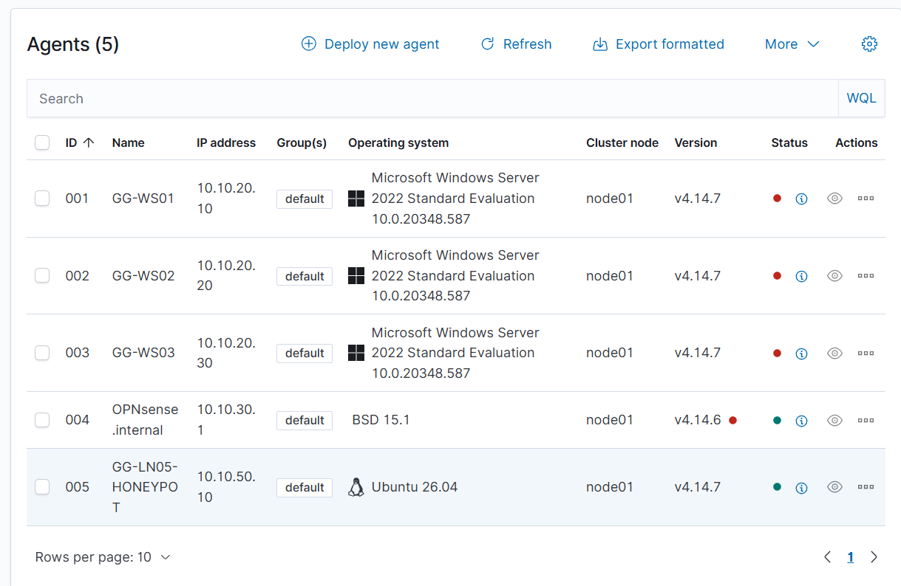

# 🪟 Active Directory — Identidade e Serviços Corporativos

## Visão Geral

O **Active Directory** é utilizado no **GG CyberLab** para simular a camada de identidade de uma organização.

O ambiente foi criado para reproduzir funções comuns de uma infraestrutura corporativa Microsoft, como:

- autenticação de usuários;
- gerenciamento de grupos;
- ingresso de máquinas no domínio;
- resolução DNS;
- políticas e permissões;
- controle de acesso;
- geração de eventos de segurança.

---

# 🏗️ Arquitetura

O principal controlador de domínio do laboratório é:

```text
Hostname: GG_WS01
IP: 10.10.20.10
VLAN: 20 - SERVERS
Sistema Operacional: Windows Server 2022
```

Domínio:

```text
gglab.corp
```

Funções principais:

```text
Active Directory Domain Services
DNS Server
Domain Controller
```

---

# 🌐 VLAN 20 — SERVERS

Rede:

```text
10.10.20.0/24
```

A VLAN 20 concentra os serviços corporativos do ambiente.

Exemplo:

```text
VLAN 20 - SERVERS
        │
        ├── GG_WS01
        │    ├── Active Directory
        │    └── DNS
        │
        ├── GG_WS02
        │    └── File Server
        │
        └── GG_WS03
             └── Serviços adicionais
```

---

# 🧠 Domínio

O domínio configurado no laboratório é:

```text
gglab.corp
```

Esse domínio representa a organização fictícia utilizada no projeto.

O Active Directory permite centralizar:

- usuários;
- grupos;
- computadores;
- políticas;
- autenticação;
- permissões.

---

# 👤 Usuários e Grupos

O ambiente permite criar usuários e grupos corporativos para simular uma organização real.

Exemplo de estrutura:

```text
gglab.corp
│
├── Users
├── Groups
├── Computers
└── Servers
```

Os grupos podem ser utilizados para:

- controle de acesso;
- permissões em compartilhamentos;
- segmentação por departamento;
- aplicação de políticas;
- delegação administrativa.

---

# 🖥️ Estações no Domínio

As estações Windows podem ser ingressadas no domínio:

```text
gglab.corp
```

Exemplo de fluxo:

```text
Windows Client
      │
      ▼
DNS
      │
      ▼
GG_WS01
      │
      ▼
Active Directory
      │
      ▼
Domain Join
```

Após o ingresso no domínio, a máquina passa a utilizar a infraestrutura de identidade centralizada.

---

# 🌐 DNS

O serviço DNS é executado no:

```text
GG_WS01
```

Ele é essencial para o funcionamento do Active Directory.

O DNS permite resolver nomes como:

```text
gglab.corp
```

e localizar serviços internos do domínio.

Fluxo:

```text
Client
  │
  ▼
DNS Query
  │
  ▼
GG_WS01
  │
  ▼
Domain Services
```

---

# 📁 Integração com File Server

O servidor:

```text
GG_WS02
```

atua como File Server.

Ele pode utilizar usuários e grupos do Active Directory para controlar permissões.

Exemplo:

```text
Usuário
   │
   ▼
Active Directory
   │
   ▼
Grupo
   │
   ▼
Permissão
   │
   ▼
Compartilhamento
```

Isso permite simular cenários como:

- acesso por departamento;
- permissões de leitura;
- permissões de gravação;
- controle centralizado.

---

# 🛡️ Monitoramento com Wazuh

Os servidores Windows podem ser integrados ao Wazuh através do agente.

Fluxo:

```text
Windows Server
      │
      ▼
Windows Event Logs
      │
      ▼
Wazuh Agent
      │
      ▼
Wazuh Manager
      │
      ▼
SOC
```
### 📸 Evidência — Servidores Windows integrados ao Wazuh

<p align="center">
  
</p>

<p align="center">
  <i>Servidores Windows registrados na plataforma de monitoramento do GG CyberLab.</i>
</p>
---

# 🔎 Eventos de Segurança

A integração com o Wazuh permite acompanhar eventos relacionados a:

- autenticação;
- falhas de login;
- logons;
- contas;
- grupos;
- alterações administrativas;
- eventos do Security Log.

Exemplos de categorias úteis:

```text
Authentication
Account Management
Group Management
Privilege Use
Security Events
```

---

# 🚨 Possível Fluxo de Detecção

Um evento de autenticação suspeita pode seguir o fluxo:

```text
Tentativa de Login
       │
       ▼
Active Directory
       │
       ▼
Windows Event Log
       │
       ▼
Wazuh Agent
       │
       ▼
Wazuh Manager
       │
       ▼
Alert
       │
       ▼
DFIR-IRIS
```

---

# 🔗 Relação com Incident Response

Caso um evento relevante seja detectado, o processo pode seguir para o IRIS.

```text
Windows Event
    │
    ▼
Wazuh
    │
    ▼
Security Alert
    │
    ▼
DFIR-IRIS
    │
    ▼
Incident Case
```

No caso de investigação de endpoint, o Velociraptor também pode ser utilizado.

---

# 🔎 Relação com DFIR

O Active Directory é uma fonte importante de informações durante uma investigação.

Alguns pontos que podem ser analisados:

- usuários;
- grupos;
- contas administrativas;
- histórico de autenticação;
- eventos de segurança;
- alterações de privilégios;
- atividades suspeitas.

Fluxo:

```text
Incident
   │
   ▼
Wazuh
   │
   ▼
IRIS
   │
   ▼
Investigation
   │
   ▼
Windows / AD Evidence
```

---

# 🧪 Papel do Active Directory no CyberLab

Dentro do projeto, o Active Directory representa a camada de:

```text
Identity
   +
Authentication
   +
Authorization
   +
Directory Services
   +
DNS
```

Isso permite que o laboratório tenha uma estrutura mais próxima de um ambiente corporativo real.

---

# 🧠 Cenários possíveis

O ambiente pode ser utilizado para estudar:

- falhas de autenticação;
- criação de usuários;
- grupos privilegiados;
- permissões incorretas;
- tentativas de acesso;
- eventos administrativos;
- monitoramento de domínio;
- resposta a incidentes envolvendo identidade.

---

# 📸 Evidências

As evidências relacionadas ao Active Directory podem ser organizadas em:

```text
images/
└── active-directory/
    ├── domain-controller.png
    ├── users-groups.png
    ├── dns.png
    ├── domain-join.png
    └── wazuh-agent.png
```

Essas imagens podem demonstrar:

- domínio configurado;
- usuários;
- grupos;
- DNS;
- estação ingressada no domínio;
- agente Wazuh ativo.

---

# 📌 Resumo

O Active Directory adiciona ao **GG CyberLab** uma camada de identidade corporativa.

```text
Users
  │
  ▼
Active Directory
  │
  ├── Authentication
  ├── Groups
  ├── DNS
  ├── Policies
  └── Permissions
        │
        ▼
      Wazuh
        │
        ▼
       SOC
```

Essa integração permite estudar segurança de identidade, monitoramento e resposta a incidentes em um ambiente controlado.

---

[⬅️ Voltar para Web Security](web-security.md)

[🏠 Voltar para o README](../README.md)
