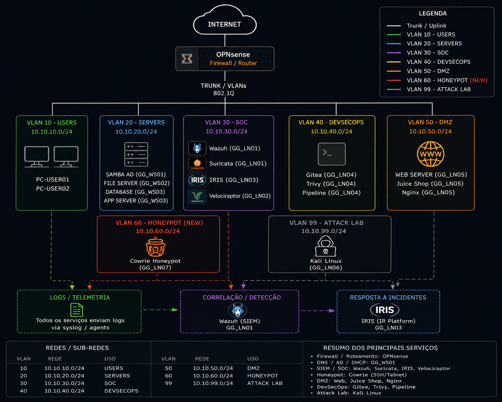

# 🏗️ Arquitetura do GG CyberLab

## Visão Geral

O **GG CyberLab** foi desenvolvido em ambiente virtualizado utilizando **Oracle VirtualBox**, com o objetivo de simular uma infraestrutura corporativa segmentada e integrada a diferentes soluções de segurança.

A arquitetura foi projetada para permitir:

- segmentação lógica por VLAN;
- separação entre usuários, servidores, SOC, DevSecOps e DMZ;
- geração controlada de eventos;
- monitoramento centralizado;
- detecção de ameaças;
- resposta a incidentes;
- investigação forense;
- testes de segurança Web;
- testes de segurança em Active Directory.

---

## 🌐 Visão da Arquitetura

<p align="center">
  
</p>

<p align="center">
  <i>Topologia lógica do ambiente GG CyberLab.</i>
</p>

---

# 🔥 Firewall e Roteamento

O firewall central do laboratório é o **OPNsense**.

Ele é responsável por:

- roteamento entre VLANs;
- segmentação dos ambientes;
- aplicação de regras de firewall;
- DHCP;
- controle de comunicação entre redes;
- acesso dos ativos à Internet.

Fluxo simplificado:

```text
Internet
   │
   ▼
OPNsense
   │
   ▼
Trunk 802.1Q
   │
   ▼
Open vSwitch
   │
   ├── VLAN 10
   ├── VLAN 20
   ├── VLAN 30
   ├── VLAN 40
   ├── VLAN 50
   └── VLAN 99
```

---

# 🔀 Switch Virtual

A distribuição das VLANs é realizada através de um servidor Linux utilizando **Open vSwitch**.

Bridge principal:

```text
br-lab
```

O switch virtual é responsável por transportar as VLANs entre o OPNsense e as máquinas virtuais do laboratório.

Exemplo da estrutura:

```text
OPNsense
   │
   │ TRUNK
   ▼
GG-SW01
Open vSwitch
   │
   ├── USERS
   ├── SERVERS
   ├── SOC
   ├── DEVSECOPS
   ├── DMZ
   └── ATTACK LAB
```

---

# 🌐 Segmentação de Rede

| VLAN | Nome | Rede | Finalidade |
|---|---|---|---|
| 10 | USERS | `10.10.10.0/24` | Estações de usuários |
| 20 | SERVERS | `10.10.20.0/24` | Servidores corporativos |
| 30 | SOC | `10.10.30.0/24` | Ferramentas de segurança |
| 40 | DEVSECOPS | `10.10.40.0/24` | Desenvolvimento seguro |
| 50 | DMZ | `10.10.50.0/24` | Serviços expostos e honeypot |
| 99 | ATTACK LAB | `10.10.99.0/24` | Ambiente de testes ofensivos |

---

# 👥 VLAN 10 — USERS

Rede:

```text
10.10.10.0/24
```

Esta VLAN representa os usuários da organização.

Ela foi criada para hospedar estações de trabalho utilizadas para:

- autenticação no domínio;
- acesso a serviços corporativos;
- testes de políticas;
- geração de telemetria;
- simulação de usuários internos.

---

# 🖥️ VLAN 20 — SERVERS

Rede:

```text
10.10.20.0/24
```

Esta VLAN concentra os principais serviços corporativos Windows.

### GG_WS01

Funções:

```text
Active Directory Domain Services
DNS Server
Domain Controller
```

Domínio:

```text
gglab.corp
```

Endereço utilizado no laboratório:

```text
10.10.20.10
```

### GG_WS02

Função principal:

```text
File Server
```

Utilizado para testes de:

- compartilhamentos;
- permissões;
- grupos do Active Directory;
- controle de acesso.

### GG_WS03

Servidor adicional destinado à simulação de serviços corporativos dentro da VLAN de servidores.

---

# 🛡️ VLAN 30 — SOC

Rede:

```text
10.10.30.0/24
```

A VLAN 30 concentra as ferramentas responsáveis pelo monitoramento, resposta a incidentes e investigação forense.

---

## GG_LN01 — Wazuh

Endereço:

```text
10.10.30.10
```

Função:

```text
SIEM / XDR
```

Componentes utilizados:

- Wazuh Manager;
- Wazuh Indexer;
- Wazuh Dashboard;
- Filebeat;
- regras de detecção customizadas.

O Wazuh recebe eventos de diferentes ativos do laboratório e realiza correlação e geração de alertas.

---

## GG_LN02 — Velociraptor

Endereço:

```text
10.10.30.20
```

Função:

```text
Digital Forensics & Incident Response
```

O Velociraptor é utilizado para:

- coleta remota de artefatos;
- análise de processos;
- análise de conexões;
- investigação de persistência;
- análise de usuários;
- resposta a incidentes.

---

## GG_LN03 — DFIR-IRIS

Endereço:

```text
10.10.30.30
```

Função:

```text
Incident Response Platform
```

O IRIS é utilizado para:

- criação de casos;
- cadastro de IOCs;
- registro de ativos;
- evidências;
- timeline;
- tarefas;
- documentação da investigação.

---

# 🔐 VLAN 40 — DEVSECOPS

Rede:

```text
10.10.40.0/24
```

Esta VLAN foi criada para simular um ambiente de desenvolvimento seguro.

Principal servidor:

```text
GG_LN04
```

Tecnologias utilizadas:

- Gitea;
- Trivy;
- Pipeline;
- Containers;
- act_runner.

Fluxo:

```text
Developer
   │
   ▼
Gitea
   │
   ▼
Pipeline
   │
   ▼
Trivy
   │
   ▼
Security Scan
```

---

# 🌐 VLAN 50 — DMZ

Rede:

```text
10.10.50.0/24
```

Principal servidor:

```text
GG_LN05
```

Endereço:

```text
10.10.50.10
```

A máquina concentra diferentes serviços destinados a testes controlados de segurança.

---

## Nginx

Responsável por atuar como:

```text
Reverse Proxy
```

O serviço Web é publicado através da porta HTTP do servidor.

---

## OWASP Juice Shop

Aplicação Web propositalmente vulnerável utilizada para testes de:

- segurança Web;
- análise de logs;
- monitoramento;
- detecção;
- resposta a eventos.

O Juice Shop é executado em container e permanece acessível internamente através do Nginx.

---

## Cowrie Honeypot

O **Cowrie** também é executado no `GG_LN05`.

Sua finalidade é simular um serviço SSH exposto para captura de:

- tentativas de autenticação;
- origem dos acessos;
- sessões;
- comandos;
- comportamento do atacante.

Fluxo:

```text
Kali
   │
   ▼
10.10.50.10:22
   │
   ▼
Cowrie
   │
   ▼
Logs JSON
   │
   ▼
Wazuh
```

---

# 🐉 VLAN 99 — ATTACK LAB

Rede:

```text
10.10.99.0/24
```

Esta VLAN é isolada para execução de testes ofensivos controlados.

Principal sistema:

```text
Kali Linux
```

Endereço observado durante os testes:

```text
10.10.99.161
```

O Kali foi utilizado para gerar eventos contra ativos pertencentes ao próprio laboratório.

Exemplo:

```text
Kali
10.10.99.161
      │
      ▼
Cowrie
10.10.50.10
      │
      ▼
Wazuh
      │
      ▼
IRIS
      │
      ▼
Velociraptor
```

---

# 🔎 Fluxo de Monitoramento

O ambiente foi projetado para centralizar eventos de segurança no Wazuh.

```text
Endpoints
   │
   ├── Windows
   ├── Linux
   ├── OPNsense
   └── Honeypot
         │
         ▼
     Wazuh Agent
         │
         ▼
     Wazuh Manager
         │
         ▼
   Detection Rules
         │
         ▼
       Alerts
```

---

# 🚨 Fluxo de Resposta a Incidentes

Quando um evento relevante é identificado:

```text
Evento
   │
   ▼
Wazuh
   │
   ▼
Alerta
   │
   ▼
DFIR-IRIS
   │
   ▼
Caso de Segurança
   │
   ▼
Velociraptor
   │
   ▼
Investigação
   │
   ▼
Conclusão
```

---

# 🧪 Ambiente Controlado

Todos os testes realizados no GG CyberLab são executados exclusivamente contra ativos pertencentes ao próprio laboratório.

O Attack Lab permanece separado das demais redes para permitir testes controlados de:

- reconhecimento;
- autenticação;
- segurança Web;
- detecção;
- análise de logs;
- resposta a incidentes.

---

# 📌 Resumo

A arquitetura do **GG CyberLab** integra diferentes disciplinas de segurança:

```text
Network Security
        +
Active Directory
        +
SOC / SIEM
        +
Honeypot
        +
Web Security
        +
Incident Response
        +
DFIR
        +
DevSecOps
```

Essa integração permite acompanhar o ciclo completo de um evento de segurança, desde sua geração até sua detecção, investigação e documentação.

---

[⬅️ Voltar para o README](../README.md)
