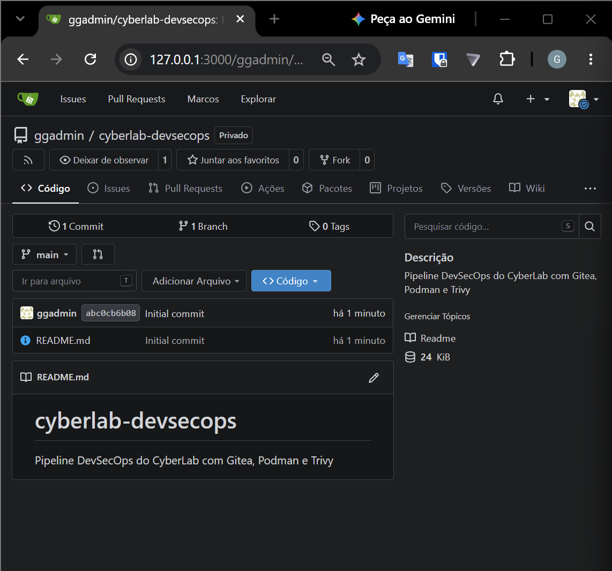
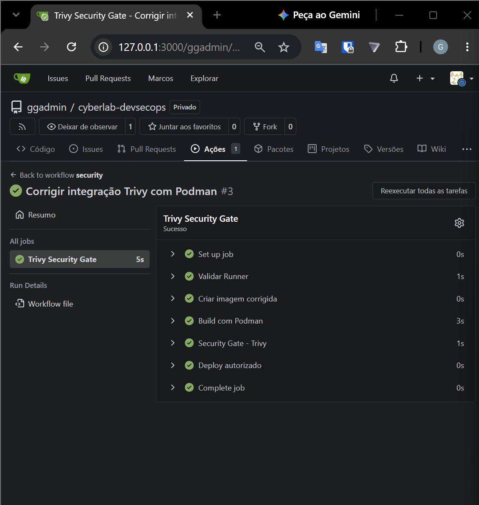
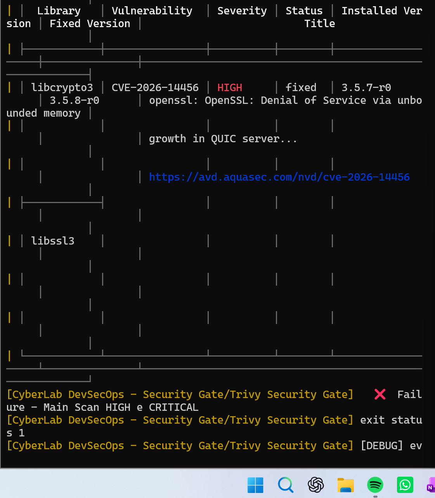

# 🔐 DevSecOps — Gitea + Trivy + Pipeline

## Visão Geral

O **GG CyberLab** possui uma área dedicada a **DevSecOps**, criada para demonstrar como práticas de segurança podem ser integradas ao ciclo de desenvolvimento.

O objetivo dessa camada é simular um fluxo em que o código é versionado, analisado e submetido a verificações de segurança antes de seguir para etapas posteriores.

A estrutura utiliza principalmente:

- Gitea
- Trivy
- Pipeline
- act_runner
- Containers
- Linux

---

# 🏗️ Arquitetura

O ambiente DevSecOps está concentrado no servidor:

```text
Hostname: GG_LN04
VLAN: 40 - DEVSECOPS
Sistema Operacional: Ubuntu Server
```

Funções principais:

```text
Git Repository
Pipeline Runner
Vulnerability Scanning
Container Security
```

---

# 🌐 VLAN 40 — DEVSECOPS

Rede:

```text
10.10.40.0/24
```

A VLAN 40 foi criada para separar a camada de desenvolvimento dos demais segmentos do laboratório.

Fluxo lógico:

```text
Developer
    │
    ▼
  Gitea
    │
    ▼
Pipeline
    │
    ▼
act_runner
    │
    ▼
  Trivy
    │
    ▼
Security Scan
```

---

# 🐙 Gitea

O **Gitea** é utilizado como repositório Git interno.

Ele permite:

- versionamento de código;
- criação de repositórios;
- gerenciamento de branches;
- acompanhamento de alterações;
- integração com pipelines;
- automação de processos.

No CyberLab, ele representa a camada de:

```text
Source Code Management
```
### 📸 Evidência — Repositório Gitea

<p align="center">
  
</p>

<p align="center">
  <i>Repositório Git interno utilizado pelo ambiente DevSecOps do CyberLab.</i>
</p>
---

# 🔄 Pipeline

O pipeline é responsável por automatizar etapas após alterações no código.

Fluxo:

```text
Commit
   │
   ▼
Gitea
   │
   ▼
Pipeline
   │
   ▼
Runner
   │
   ▼
Security Checks
```

O objetivo é reduzir tarefas manuais e inserir validações de segurança no processo.

---

# 🏃 act_runner

O **act_runner** é utilizado como runner responsável por executar os jobs definidos no pipeline.

Função:

```text
Pipeline Execution
```

Fluxo:

```text
Gitea
  │
  ▼
Workflow
  │
  ▼
act_runner
  │
  ▼
Job Execution
```

O serviço foi utilizado no servidor GG_LN04 para processar as automações do ambiente.

---

# 🔍 Trivy

O **Trivy** é utilizado como ferramenta de análise de segurança.

Ele pode identificar vulnerabilidades em:

- imagens de container;
- dependências;
- sistemas de arquivos;
- pacotes;
- artefatos de aplicação.

Função no projeto:

```text
Vulnerability Scanner
```

---

# 🐳 Containers

Containers são utilizados em diferentes partes do GG CyberLab.

Na camada DevSecOps, eles permitem estudar:

- empacotamento;
- isolamento;
- análise de imagens;
- vulnerabilidades;
- automação;
- segurança de runtime.

O Trivy pode ser utilizado para analisar imagens antes da utilização.

Fluxo:

```text
Container Image
      │
      ▼
    Trivy
      │
      ▼
Vulnerability Scan
      │
      ▼
Result
```

---

# 🛡️ Security Gate

O conceito central utilizado no pipeline é inserir uma validação de segurança antes da continuidade do processo.

Exemplo:

```text
Code
  │
  ▼
Commit
  │
  ▼
Pipeline
  │
  ▼
Trivy Scan
  │
  ├── Vulnerability Found
  │        │
  │        ▼
  │      Review
  │
  └── No Critical Finding
           │
           ▼
        Continue
```

Esse modelo representa um **Security Gate**.
### 📸 Evidência — Security Gate aprovado

<p align="center">
  
</p>

<p align="center">
  <i>Execução do pipeline de segurança com validação concluída com sucesso.</i>
</p>

### 📸 Evidência — Security Gate bloqueando vulnerabilidade

<p align="center">
  
</p>

<p align="center">
  <i>Exemplo de execução em que o Security Gate interrompe o processo devido aos critérios de segurança definidos.</i>
</p>
---

# 🔐 Shift Left Security

A camada DevSecOps aplica o conceito de:

```text
Shift Left Security
```

A ideia é executar verificações de segurança mais cedo no ciclo de desenvolvimento.

Em vez de analisar apenas no final:

```text
Develop
   ↓
Deploy
   ↓
Security
```

o objetivo é utilizar:

```text
Develop
   ↓
Security Check
   ↓
Build
   ↓
Deploy
```

---

# 🧠 Benefícios

A integração entre Gitea, runner e Trivy permite demonstrar:

- automação;
- versionamento;
- análise de vulnerabilidades;
- segurança no pipeline;
- redução de riscos;
- integração entre desenvolvimento e segurança.

---

# 🔎 Fluxo DevSecOps

```text
Developer
    │
    ▼
  Commit
    │
    ▼
   Gitea
    │
    ▼
 Workflow
    │
    ▼
act_runner
    │
    ▼
   Trivy
    │
    ▼
Security Result
```

---

# 📦 Exemplo de Validação

Um fluxo típico pode funcionar da seguinte maneira:

```text
1. Código é enviado ao Gitea
2. Pipeline é iniciado
3. act_runner executa o workflow
4. Trivy realiza a análise
5. Vulnerabilidades são identificadas
6. Resultado é registrado
7. Processo continua ou é interrompido
```

---

# 🚨 Relação com Segurança

A camada DevSecOps complementa as demais áreas do CyberLab.

Enquanto o SOC atua em:

```text
Detection
Monitoring
Incident Response
```

o DevSecOps atua em:

```text
Prevention
Automation
Secure Development
Vulnerability Management
```

---

# 🔗 Integração com o CyberLab

O projeto demonstra diferentes momentos do ciclo de segurança.

```text
ANTES DO DEPLOY
DevSecOps
   │
   ▼
Security Scan

DURANTE A OPERAÇÃO
SOC / Wazuh
   │
   ▼
Monitoring

APÓS UM EVENTO
IRIS
   │
   ▼
Incident Response

INVESTIGAÇÃO
Velociraptor
   │
   ▼
DFIR
```

---

# 🧱 Separação de Ambientes

A VLAN dedicada ajuda a manter o ambiente DevSecOps separado dos demais segmentos.

```text
VLAN 40
DEVSECOPS
10.10.40.0/24
```

Isso permite trabalhar com:

- repositórios;
- pipelines;
- containers;
- scanners;
- automações;

sem misturar diretamente esses serviços com a DMZ ou o SOC.

---

# 📊 Papel do DevSecOps no Projeto

Dentro do GG CyberLab, essa camada representa:

```text
Secure Development
       +
Automation
       +
Vulnerability Scanning
       +
CI/CD Security
       +
Shift Left
```

---

# 🧠 Competências Demonstradas

A implementação permite demonstrar conhecimentos em:

- Git
- Gitea
- Pipelines
- CI/CD
- act_runner
- Trivy
- Vulnerability Management
- Containers
- Linux
- DevSecOps
- Security Automation

---

# 📸 Evidências

As evidências desta área podem ser organizadas em:

```text
images/
└── devsecops/
    ├── gitea.png
    ├── repository.png
    ├── pipeline.png
    ├── runner.png
    ├── trivy-scan.png
    └── vulnerability-result.png
```

Essas imagens podem demonstrar:

- interface do Gitea;
- repositório criado;
- pipeline;
- act_runner;
- execução do Trivy;
- resultado da análise.

---

# 📌 Resumo

A camada DevSecOps do GG CyberLab adiciona segurança ao ciclo de desenvolvimento.

```text
Developer
   ↓
Gitea
   ↓
Pipeline
   ↓
act_runner
   ↓
Trivy
   ↓
Security Validation
```

Com isso, o projeto demonstra não apenas monitoramento e resposta a incidentes, mas também **segurança preventiva integrada ao desenvolvimento**.

---

[⬅️ Voltar para Velociraptor](velociraptor.md)

[🏠 Voltar para o README](../README.md)
