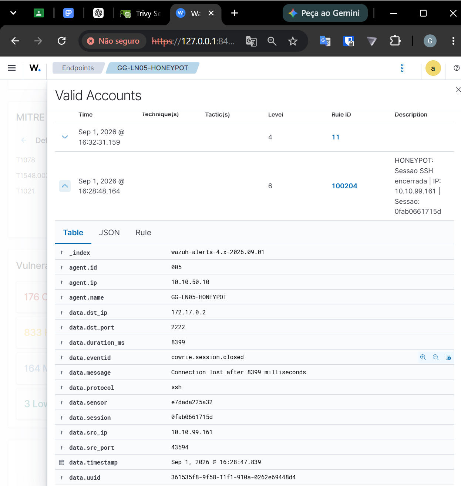

# 🍯 Honeypot — Cowrie

## Visão Geral

O **Cowrie** é o honeypot utilizado no **GG CyberLab** para simular um serviço SSH exposto e registrar atividades de autenticação contra o ambiente.

Ele faz parte da camada de **DMZ** e foi integrado ao Wazuh para que tentativas de acesso sejam transformadas em eventos de segurança e posteriormente tratadas dentro do processo de Incident Response.

---

# 🏗️ Arquitetura do Honeypot

O Cowrie é executado no servidor:

```text
Hostname: GG_LN05
IP: 10.10.50.10
VLAN: 50 - DMZ
Sistema Operacional: Ubuntu Server
```

O mesmo servidor também executa:

- Nginx
- OWASP Juice Shop
- Docker
- Wazuh Agent
- Velociraptor Client

---

# 🌐 Posicionamento na Rede

O GG_LN05 está localizado na rede:

```text
10.10.50.0/24
```

Segmento:

```text
VLAN 50 - DMZ
```

A função da DMZ é concentrar serviços que podem receber tráfego vindo de outras redes do laboratório.

Fluxo simplificado:

```text
ATTACK LAB
10.10.99.0/24
      │
      ▼
    Kali
      │
      ▼
OPNsense
      │
      ▼
VLAN 50 - DMZ
      │
      ▼
GG_LN05
10.10.50.10
      │
      ▼
Cowrie
```

---

# 🐳 Execução em Container

O Cowrie foi executado através de container.

Imagem utilizada:

```text
cowrie/cowrie:latest
```

O serviço SSH do honeypot é publicado externamente na porta:

```text
TCP/22
```

e direcionado para a porta interna do Cowrie:

```text
2222/tcp
```

Mapeamento lógico:

```text
10.10.50.10:22
        │
        ▼
docker-proxy
        │
        ▼
Cowrie Container
        │
        ▼
2222/tcp
```

---

# 🔐 Separação do SSH Administrativo

O GG_LN05 possui também um serviço SSH real para administração do servidor.

Esse acesso não é exposto da mesma forma que o Cowrie na interface da DMZ.

Durante a análise do ambiente, foi observado:

```text
10.10.50.10:22
→ docker-proxy
→ Cowrie
```

Enquanto o SSH administrativo real permaneceu associado à interface de administração/NAT do laboratório.

Isso permite que:

- o tráfego SSH recebido pela DMZ seja direcionado ao honeypot;
- o administrador continue tendo acesso real ao servidor por um caminho separado.

---

### 📸 Evidência — Evento do Cowrie correlacionado no Wazuh

<p align="center">
  
</p>

<p align="center">
  <i>Detalhes do evento gerado pelo Cowrie e recebido pelo Wazuh, incluindo agente, IP de origem, porta de destino e identificador da sessão.</i>
</p>

---

# 📄 Logs JSON

O formato JSON facilita a extração de campos importantes do evento.

Exemplos de informações disponíveis:

- endereço IP de origem;
- horário;
- identificador da sessão;
- nome do evento;
- tentativa de autenticação;
- encerramento de sessão;
- dados relacionados à conexão.

Fluxo:

```text
SSH Attempt
    │
    ▼
Cowrie
    │
    ▼
JSON Log
    │
    ▼
Wazuh Agent
```

---

# 🐉 Origem do Teste

A máquina utilizada para gerar o evento pertence à VLAN de ataque.

```text
Sistema: Kali Linux
VLAN: 99 - ATTACK LAB
IP: 10.10.99.161
```

O Kali foi utilizado exclusivamente para testes controlados dentro do próprio laboratório.

---

# 🔥 Cenário Validado

O cenário utilizado para validar o honeypot foi:

```text
Kali Linux
10.10.99.161
      │
      ▼
Tentativa SSH
      │
      ▼
GG_LN05
10.10.50.10:22
      │
      ▼
Cowrie
      │
      ▼
cowrie.login.failed
```

Posteriormente, a sessão também gerou:

```text
cowrie.session.closed
```

---

# 📊 Integração com o Wazuh

O Wazuh Agent instalado no GG_LN05 coleta os eventos gerados pelo Cowrie.

Fluxo:

```text
Cowrie
   │
   ▼
JSON Logs
   │
   ▼
Wazuh Agent
   │
   ▼
Wazuh Manager
   │
   ▼
Custom Rules
   │
   ▼
Alerts
```

---

# 🧠 Regra 100200

A tentativa de login foi correlacionada pelo Wazuh através da regra:

```text
Rule ID: 100200
```

Descrição observada:

```text
HONEYPOT: Tentativa de login SSH falhou
```

Endereço identificado:

```text
10.10.99.161
```

Relação:

```text
cowrie.login.failed
        │
        ▼
Wazuh Rule 100200
        │
        ▼
Security Alert
```

---

# 🔎 Regra 100204

O encerramento da sessão também foi identificado.

```text
Rule ID: 100204
```

Descrição:

```text
HONEYPOT: Sessao SSH encerrada
```

Evento relacionado:

```text
cowrie.session.closed
```

---

# 🚨 Fluxo até Incident Response

A integração permitiu transformar uma atividade capturada pelo honeypot em um processo completo de resposta.

```text
Kali
  │
  ▼
Cowrie
  │
  ▼
Wazuh
  │
  ▼
Alert
  │
  ▼
DFIR-IRIS
  │
  ▼
Incident Case
  │
  ▼
Velociraptor
  │
  ▼
DFIR Investigation
```

---

# 📋 IOC Gerado

O principal IOC associado ao cenário foi:

```text
10.10.99.161
```

Tipo registrado no IRIS:

```text
ip-src
```

Esse IOC representa o endereço de origem da tentativa de autenticação SSH.

---

# 🖥️ Ativo Investigado

O ativo relacionado ao incidente foi registrado como:

```text
GG_LN05-HONEYPOT
```

Endereço:

```text
10.10.50.10
```

Função:

```text
DMZ / Honeypot / Web
```

---

# 🔎 Investigação com Velociraptor

Após a detecção, o servidor foi investigado com Velociraptor.

Foram coletados artefatos relacionados a:

- processos;
- conexões de rede;
- portas em escuta;
- tarefas agendadas;
- usuários privilegiados;
- registros de login.

Durante a investigação foi confirmado que a porta:

```text
10.10.50.10:22
```

estava associada ao:

```text
docker-proxy
```

compatível com o mapeamento do Cowrie.

---

# ✅ Resultado

O cenário comprovou o funcionamento do honeypot dentro do laboratório.

Fluxo validado:

```text
Kali
  ↓
SSH Attempt
  ↓
Cowrie
  ↓
JSON Log
  ↓
Wazuh
  ↓
Rule 100200
  ↓
Alert
  ↓
IRIS
  ↓
Velociraptor
```

Durante a análise DFIR, **nenhum indicador de comprometimento foi identificado nos artefatos coletados do host**.

A atividade permaneceu restrita ao ambiente controlado do honeypot.

---

# 🛡️ Papel do Honeypot no CyberLab

Dentro do projeto, o Cowrie representa uma camada de:

```text
Deception
   +
Threat Detection
   +
Telemetry Generation
   +
Attack Observation
```

Ele permite observar tentativas de acesso sem expor diretamente o serviço SSH administrativo real do servidor.

---

# 📸 Evidências

As evidências do Honeypot podem ser organizadas em:

```text
images/
└── honeypot/
    ├── cowrie-container.png
    ├── cowrie-logs.png
    ├── ssh-attempt.png
    └── wazuh-alert.png
```

Essas imagens podem demonstrar:

- container em execução;
- mapeamento de porta;
- logs JSON;
- tentativa de autenticação;
- alerta gerado no Wazuh.

---

# 📌 Resumo

O Cowrie foi utilizado como ponto de captura para atividades SSH dentro da DMZ.

```text
Attack Lab
    ↓
Cowrie
    ↓
Wazuh
    ↓
IRIS
    ↓
Velociraptor
```

Esse fluxo permitiu demonstrar a integração entre **deception, detecção, resposta a incidentes e investigação forense**.

---

[⬅️ Voltar para Wazuh](wazuh.md)

[🏠 Voltar para o README](../README.md)
