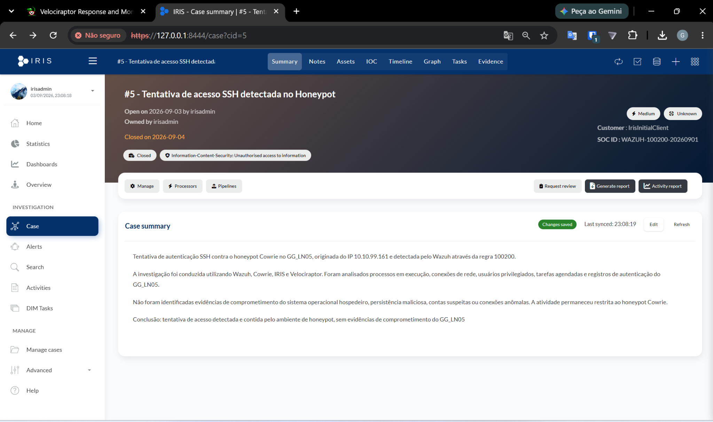
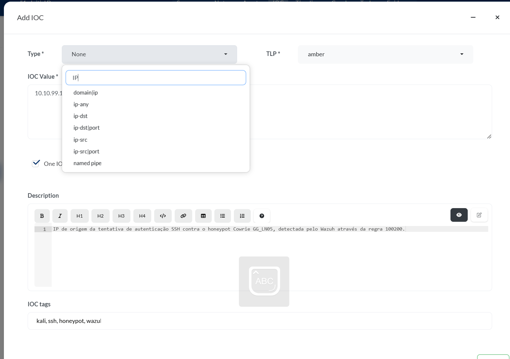
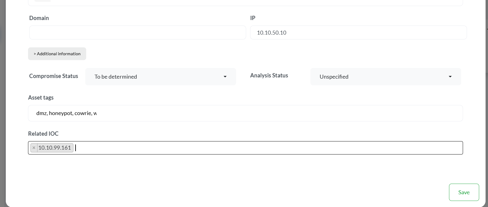

# 🚨 Incident Response — DFIR-IRIS

## Visão Geral

O **DFIR-IRIS** é utilizado no **GG CyberLab** como plataforma de gestão de incidentes.

Ele recebe os eventos relevantes identificados pelo SOC e organiza todas as informações necessárias para investigação, documentação e encerramento do caso.

Dentro do laboratório, o IRIS é utilizado para:

- criação de casos;
- registro de IOCs;
- cadastro de ativos;
- armazenamento de evidências;
- criação de tarefas;
- timeline do incidente;
- classificação;
- severidade;
- acompanhamento da investigação;
- conclusão do caso.

---

# 🏗️ Arquitetura

O IRIS está instalado no servidor:

```text
Hostname: GG_LN03
IP: 10.10.30.30
VLAN: 30 - SOC
Sistema Operacional: Ubuntu Server
```

A aplicação é executada em containers Docker.

Entre os componentes observados no ambiente:

```text
iriswebapp_app
iriswebapp_worker
iriswebapp_nginx
iriswebapp_rabbitmq
iriswebapp_db
```

Fluxo lógico:

```text
Wazuh
  │
  ▼
Security Alert
  │
  ▼
DFIR-IRIS
  │
  ▼
Incident Case
  │
  ├── IOC
  ├── Asset
  ├── Evidence
  ├── Tasks
  └── Timeline
```

---

# 🔥 Caso Validado

Durante o cenário de teste foi criado o caso:

```text
Case #5
Tentativa de acesso SSH detectada no Honeypot
```

O evento teve origem na detecção realizada pelo Wazuh.

### 📸 Evidência — Case #5

<p align="center">
  
</p>

<p align="center">
  <i>Caso de resposta a incidentes criado no DFIR-IRIS a partir da detecção realizada pelo Wazuh.</i>
</p>
---

# 📊 Origem do Alerta

O Wazuh identificou uma tentativa de autenticação SSH contra o Cowrie.

Regra:

```text
Rule ID: 100200
```

Origem:

```text
10.10.99.161
```

Destino:

```text
GG_LN05-HONEYPOT
10.10.50.10
```

---

# 🧠 Resumo do Caso

Resumo utilizado:

```text
Tentativa de autenticação SSH contra o honeypot Cowrie no GG_LN05,
originada do IP 10.10.99.161 e detectada pelo Wazuh através da regra 100200.
```

---

# 🏷️ Classificação

O caso foi classificado como:

```text
Information-Content-Security:
Unauthorised access to information
```

Severidade:

```text
Medium
```

---

# 🆔 SOC ID

Foi utilizado o identificador:

```text
WAZUH-100200-20260901
```

Esse identificador ajuda a relacionar o alerta do SIEM com o caso criado no IRIS.

---

# 🌐 IOC

O principal IOC registrado foi:

```text
10.10.99.161
```

Tipo:

```text
ip-src
```

Classificação TLP:

```text
TLP:AMBER
```

Descrição:

```text
Endereço IP de origem da tentativa de autenticação SSH
contra o Cowrie, detectada pelo Wazuh através da regra 100200.
```

Tags utilizadas:

```text
kali
ssh
honeypot
wazuh
```
### 📸 Evidência — IOC

<p align="center">
  
</p>

<p align="center">
  <i>Registro do endereço 10.10.99.161 como IOC associado à tentativa de autenticação SSH.</i>
</p>
---

# 🖥️ Asset

Ativo relacionado ao incidente:

```text
GG_LN05-HONEYPOT
```

IP:

```text
10.10.50.10
```

Tipo:

```text
Linux - Server
```

Descrição:

```text
Servidor DMZ executando Cowrie Honeypot e Nginx/Juice Shop.
```

O ativo foi relacionado ao IOC:

```text
10.10.99.161
```
### 📸 Evidência — Ativo investigado

<p align="center">
  
</p>

<p align="center">
  <i>Ativo GG_LN05-HONEYPOT relacionado ao incidente e à investigação DFIR.</i>
</p>

---

# ✅ Status do Asset

Após a investigação forense, o ativo foi atualizado para indicar que não foram identificados sinais de comprometimento.

Status esperado:

```text
Compromise Status: Not compromised
Analysis Status: Done
```

---

# 📋 Tasks

Foram criadas tarefas para acompanhar o processo de investigação.

Exemplos:

```text
Validar alerta do Wazuh
Analisar logs do Cowrie
Investigar GG_LN05-HONEYPOT com Velociraptor
```

Ao final da investigação, todas foram marcadas como concluídas.

---

# 📎 Evidências

O IRIS foi utilizado para armazenar evidências relacionadas ao caso.

Entre elas:

```text
Wazuh - Alerta SSH Honeypot Rule 100200
Velociraptor - Análise DFIR GG_LN05
```

As evidências foram registradas com informações como:

- nome;
- descrição;
- arquivo;
- tamanho;
- hash;
- contexto da investigação.

---

# 📸 Evidência do Wazuh

A evidência do Wazuh representou o momento de detecção do evento.

Exemplo:

```text
Rule ID: 100200
Source IP: 10.10.99.161
Target: GG_LN05-HONEYPOT
```

---

# 🔎 Evidência do Velociraptor

A evidência da investigação DFIR foi registrada como:

```text
Velociraptor - Análise DFIR GG_LN05
```

Descrição:

```text
Evidência da análise forense realizada no GG_LN05-HONEYPOT
através do Velociraptor.

Foram analisados processos, conexões de rede, tarefas agendadas,
usuários privilegiados e registros de login, sem identificação
de indicadores de comprometimento.
```

---

# ⏱️ Timeline

A timeline foi utilizada para registrar os principais eventos do incidente.

Evento inicial:

```text
Tentativa de autenticação SSH detectada
```

Descrição:

```text
O Wazuh detectou uma tentativa de autenticação SSH contra
o Cowrie no GG_LN05, originada do IP 10.10.99.161
na VLAN 99 e correlacionada através da regra 100200.
```

---

# 🔎 Evento de Conclusão DFIR

Também foi utilizado um evento de encerramento da investigação:

```text
Análise DFIR concluída com Velociraptor
```

Descrição:

```text
Foi realizada análise forense do GG_LN05-HONEYPOT utilizando
o Velociraptor.

Não foram identificados indicadores de comprometimento,
persistência maliciosa, contas suspeitas ou conexões anômalas.

A atividade permaneceu restrita ao honeypot Cowrie.
```

---

# 🔍 Investigação

A investigação do ativo foi realizada com Velociraptor.

Foram analisados:

- processos;
- conexões;
- portas em escuta;
- usuários privilegiados;
- tarefas agendadas;
- histórico de login;
- eventos SSH.

---

# 🧪 Artefatos Utilizados

```text
Linux.Sys.Pslist
Linux.Network.Netstat
Linux.Sys.Crontab
Linux.Sys.LastUserLogin
Linux.Syslog.SSHLogin
Linux.Users.RootUsers
```

---

# ✅ Resultado da Investigação

Durante a análise não foram identificados:

- processos maliciosos;
- contas privilegiadas suspeitas;
- mecanismos de persistência anômalos;
- conexões incompatíveis com o ambiente.

Os serviços observados estavam de acordo com a arquitetura esperada:

```text
Cowrie
Nginx
Docker
SSH
Velociraptor Client
Juice Shop
```

---

# 🧠 Conclusão

Conclusão utilizada no caso:

> Nenhum indicador de comprometimento foi identificado nos artefatos coletados pelo Velociraptor.

A evidência observada é compatível com uma atividade restrita ao honeypot Cowrie e não demonstrou comprometimento do sistema operacional hospedeiro.

---

# 🔄 Fluxo Completo do Incidente

```text
Kali Linux
10.10.99.161
      │
      ▼
SSH Attempt
      │
      ▼
Cowrie
GG_LN05
10.10.50.10
      │
      ▼
Wazuh
      │
      ▼
Rule 100200
      │
      ▼
Security Alert
      │
      ▼
DFIR-IRIS
      │
      ▼
Case #5
      │
      ├── IOC
      ├── Asset
      ├── Evidence
      ├── Tasks
      └── Timeline
              │
              ▼
        Velociraptor
              │
              ▼
       DFIR Investigation
              │
              ▼
          Conclusion
```

---

# 🛡️ Papel do IRIS no CyberLab

Dentro do GG CyberLab, o IRIS representa a camada de:

```text
Incident Management
      +
Evidence Tracking
      +
IOC Management
      +
Case Management
      +
Investigation Workflow
```

---

# 📸 Evidências

As imagens do IRIS podem ser organizadas em:

```text
images/
└── incident-response/
    ├── case-overview.png
    ├── ioc.png
    ├── asset.png
    ├── evidence-wazuh.png
    ├── evidence-velociraptor.png
    ├── tasks.png
    └── timeline.png
```

Essas imagens podem demonstrar:

- abertura do caso;
- IOC;
- ativo;
- evidências;
- tarefas;
- timeline;
- conclusão.

---

# 📌 Resumo

O DFIR-IRIS foi utilizado para transformar um alerta técnico em um processo estruturado de resposta a incidentes.

```text
Detection
   ↓
Wazuh
   ↓
Incident
   ↓
IRIS
   ↓
Investigation
   ↓
Velociraptor
   ↓
Evidence
   ↓
Conclusion
```

Com isso, o CyberLab demonstra não apenas a detecção de um evento, mas também sua **documentação, investigação e encerramento**.

---

[⬅️ Voltar para Active Directory](active-directory.md)

[🏠 Voltar para o README](../README.md)
