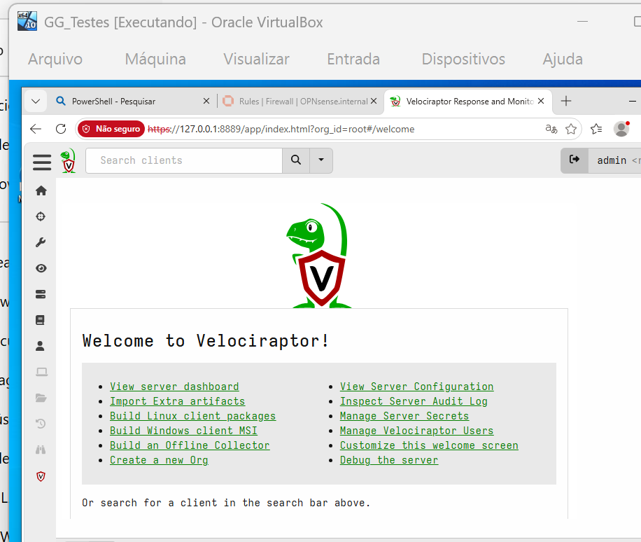

# 🔎 Velociraptor — Digital Forensics & Incident Response

## Visão Geral

O **Velociraptor** é utilizado no **GG CyberLab** como ferramenta de **DFIR — Digital Forensics & Incident Response**.

Ele permite realizar coleta remota de artefatos, análise de endpoints e investigação de possíveis indicadores de comprometimento.

Dentro do laboratório, o Velociraptor foi utilizado para investigar o ativo:

```text
GG_LN05-HONEYPOT
10.10.50.10
```

após uma tentativa de autenticação SSH detectada pelo Wazuh.

---

# 🏗️ Arquitetura

O servidor Velociraptor está instalado em:

```text
Hostname: GG_LN02
IP: 10.10.30.20
VLAN: 30 - SOC
Sistema Operacional: Ubuntu Server
```

Função:

```text
DFIR Server
```

Fluxo:

```text
Endpoint
   │
   ▼
Velociraptor Client
   │
   ▼
Velociraptor Server
   │
   ▼
Artifact Collection
   │
   ▼
DFIR Analysis
```

---

### 📸 Evidência — Velociraptor

<p align="center">
  
</p>

<p align="center">
  <i>Console do Velociraptor utilizado para gerenciamento e investigação dos endpoints do GG CyberLab.</i>
</p>

---
# 🌐 Acesso ao Velociraptor

A interface Web do Velociraptor permanece disponível localmente no servidor.

Porta utilizada:

```text
127.0.0.1:8889
```

O acesso administrativo foi realizado através de túnel SSH.

Exemplo:

```bash
ssh -N -L 8889:127.0.0.1:8889 -p 2232 ggadmin@127.0.0.1
```

Após a criação do túnel, a interface pode ser acessada através de:

```text
https://127.0.0.1:8889
```

---

# 🖥️ Cliente Investigado

O cliente Linux foi instalado no:

```text
Hostname: gg-ln05
IP: 10.10.50.10
Sistema Operacional: Ubuntu
Arquitetura: amd64
```

Client ID observado:

```text
C.d90d3c24c783e214
```

Versão do agente:

```text
0.77.2
```

---

# 📦 Instalação do Cliente

O pacote Linux utilizado foi:

```text
velociraptor_client_0.77.2_amd64.deb
```

O arquivo foi transferido para o GG_LN05 e instalado utilizando:

```bash
sudo dpkg -i /home/ggadmin/velociraptor_client_0.77.2_amd64.deb
```

Após a instalação, foi criado o serviço:

```text
velociraptor_client.service
```

---

# ⚙️ Serviço do Cliente

O serviço foi validado através do systemd.

Comando:

```bash
systemctl status velociraptor_client
```

Status esperado:

```text
Active: active (running)
```

Processo associado:

```text
/usr/local/bin/velociraptor_client
```

Configuração:

```text
/etc/velociraptor/client.config.yaml
```

---

# ✅ Conectividade

Após a instalação, o endpoint apareceu no console do Velociraptor como:

```text
gg-ln05
```

Status:

```text
Connected
```

IP observado:

```text
10.10.50.10
```

Isso confirmou a comunicação entre:

```text
GG_LN05
   │
   ▼
Velociraptor Client
   │
   ▼
GG_LN02
Velociraptor Server
```

---

# 🔥 Contexto da Investigação

O endpoint foi investigado após a detecção de uma tentativa de autenticação SSH contra o Cowrie Honeypot.

Fluxo:

```text
Kali
10.10.99.161
      │
      ▼
Cowrie
GG_LN05
10.10.50.10
      │
      ▼
Wazuh
      │
      ▼
Alert
Rule 100200
      │
      ▼
IRIS
      │
      ▼
Velociraptor
```

---

# 🧪 Primeira Coleta

A primeira collection foi utilizada para análise de:

```text
Linux.Sys.Pslist
Linux.Network.Netstat
```

Objetivo:

- verificar processos em execução;
- identificar portas em escuta;
- verificar conexões de rede;
- confirmar os serviços esperados.

---

# 🧠 Linux.Sys.Pslist

O artefato:

```text
Linux.Sys.Pslist
```

foi utilizado para enumerar processos em execução.

Durante a análise, não foram identificados processos claramente incompatíveis com a função do servidor.

Os processos observados eram consistentes com os serviços utilizados no laboratório.

---

# 🌐 Linux.Network.Netstat

O artefato:

```text
Linux.Network.Netstat
```

foi utilizado para analisar:

- sockets;
- portas;
- conexões;
- processos associados.

Entre os resultados observados:

```text
10.10.50.10:22
State: LISTEN
Process: docker-proxy
```

Esse resultado é compatível com o Cowrie publicado na DMZ.

---

# 🔐 SSH Administrativo

Também foi observado:

```text
10.0.3.15:22
State: LISTEN
Process: sshd
```

Esse serviço corresponde ao SSH administrativo real do servidor na interface NAT.

Assim, o ambiente possuía separação entre:

```text
DMZ SSH
10.10.50.10:22
→ Cowrie
```

e:

```text
Administrative SSH
10.0.3.15:22
→ sshd
```

---

# 🌐 Nginx

O Netstat também identificou:

```text
0.0.0.0:80
State: LISTEN
Process: nginx
```

Esse resultado corresponde ao serviço Web publicado na DMZ.

---

# 🧪 Juice Shop

Também foi observado:

```text
127.0.0.1:3000
State: LISTEN
Process: docker-proxy
```

Esse serviço corresponde ao OWASP Juice Shop.

A aplicação permanece acessível somente localmente e é publicada através do Nginx.

---

# 📊 Interpretação da Primeira Coleta

Os resultados observados eram compatíveis com a arquitetura esperada:

```text
22/tcp
→ Cowrie

80/tcp
→ Nginx

127.0.0.1:3000
→ Juice Shop

10.0.3.15:22
→ SSH Administrativo
```

Nenhuma conexão analisada indicou, por si só, comprometimento do host.

---

# 🧪 Segunda Coleta

A segunda collection foi criada para aprofundar a análise de persistência e autenticação.

Artefatos utilizados:

```text
Linux.Sys.Crontab
Linux.Sys.LastUserLogin
Linux.Syslog.SSHLogin
Linux.Users.RootUsers
```

---

# ⏱️ Linux.Sys.Crontab

O artefato:

```text
Linux.Sys.Crontab
```

foi utilizado para analisar tarefas agendadas.

Foram observadas entradas do sistema relacionadas a:

```text
cron.hourly
cron.daily
cron.weekly
cron.monthly
e2scrub
```

Não foram identificadas tarefas claramente suspeitas envolvendo, por exemplo:

```text
/tmp
curl
wget
bash remoto
download de payload
```

---

# 👑 Linux.Users.RootUsers

O artefato:

```text
Linux.Users.RootUsers
```

foi utilizado para identificar contas com privilégio UID 0.

Resultado observado:

```text
User: root
UID: 0
GID: 0
Home: /root
Shell: /bin/bash
```

Não foram identificadas contas adicionais inesperadas com UID 0.

---

# 👤 Linux.Sys.LastUserLogin

O artefato:

```text
Linux.Sys.LastUserLogin
```

foi utilizado para analisar os últimos logins no servidor.

Foram observadas conexões associadas ao usuário:

```text
ggadmin
```

e origem:

```text
10.0.3.2
```

Esses acessos eram compatíveis com as conexões administrativas realizadas durante a implementação do laboratório.

---

# 🔐 Linux.Syslog.SSHLogin

O artefato:

```text
Linux.Syslog.SSHLogin
```

foi utilizado para complementar a análise de acessos SSH.

O objetivo era identificar:

- autenticações;
- origens;
- usuários;
- atividades anômalas.

Os dados analisados não demonstraram atividade administrativa inesperada no host.

---

# 🔍 Itens Investigados

Durante a análise DFIR foram revisados:

- processos em execução;
- conexões;
- portas em escuta;
- contas privilegiadas;
- tarefas agendadas;
- histórico de login;
- eventos SSH;
- serviços do servidor.

---

# ✅ Resultado

Com base nos artefatos coletados, não foram identificados indicadores evidentes de:

```text
Malware
Persistência maliciosa
Conta privilegiada suspeita
Processo anômalo
Conexão anômala
```

Os serviços observados estavam de acordo com o esperado para o GG_LN05.
### 📸 Evidência — Análise DFIR do GG_LN05

<p align="center">
  
</p>

<p align="center">
  <i>Coletas e artefatos utilizados durante a investigação forense do GG_LN05-HONEYPOT.</i>
</p>
---

# 🧠 Conclusão DFIR

A conclusão registrada para a investigação foi:

> Nenhum indicador de comprometimento foi identificado nos artefatos coletados pelo Velociraptor.

A evidência analisada foi consistente com uma atividade restrita ao honeypot Cowrie.

Não foi observada evidência, nos artefatos coletados, de comprometimento do sistema operacional hospedeiro.

---

# 🚨 Relação com o IRIS

O resultado da investigação foi utilizado para concluir o caso no DFIR-IRIS.

Fluxo:

```text
Wazuh Alert
    │
    ▼
IRIS Case
    │
    ▼
Velociraptor
    │
    ▼
Artifact Collection
    │
    ▼
Analysis
    │
    ▼
Evidence
    │
    ▼
Conclusion
```

---

# 📎 Evidência Registrada

No IRIS foi adicionada a evidência:

```text
Velociraptor - Análise DFIR GG_LN05
```

Descrição:

```text
Evidência da análise forense realizada no GG_LN05-HONEYPOT
através do Velociraptor.

Foram analisados processos, conexões de rede, tarefas agendadas,
usuários privilegiados e registros de login, sem identificação
de indicadores de comprometimento.
```

---

# 🛡️ Papel do Velociraptor no CyberLab

Dentro do GG CyberLab, o Velociraptor representa a camada de:

```text
Endpoint Visibility
       +
Artifact Collection
       +
Digital Forensics
       +
Incident Investigation
       +
DFIR
```

---

# 🔄 Fluxo Completo

```text
Detection
   │
   ▼
Wazuh
   │
   ▼
Incident Response
   │
   ▼
IRIS
   │
   ▼
Endpoint Investigation
   │
   ▼
Velociraptor
   │
   ▼
Artifacts
   │
   ▼
Analysis
   │
   ▼
Conclusion
```

---

# 📸 Evidências

As evidências relacionadas ao Velociraptor podem ser organizadas em:

```text
images/
└── velociraptor/
    ├── client-connected.png
    ├── pslist.png
    ├── netstat.png
    ├── crontab.png
    ├── root-users.png
    ├── last-login.png
    └── dfir-analysis.png
```

Essas imagens podem demonstrar:

- cliente conectado;
- collections;
- Pslist;
- Netstat;
- Crontab;
- RootUsers;
- logins;
- conclusão da investigação.

---

# 📌 Resumo

O Velociraptor foi utilizado para transformar um alerta do SOC em uma investigação técnica de endpoint.

```text
Alert
  ↓
IRIS
  ↓
Velociraptor
  ↓
Collection
  ↓
Analysis
  ↓
Evidence
  ↓
Conclusion
```

Com isso, o GG CyberLab demonstra a etapa de **investigação forense** dentro de um processo completo de resposta a incidentes.

---

[⬅️ Voltar para Incident Response](incident-response.md)

[🏠 Voltar para o README](../README.md)
